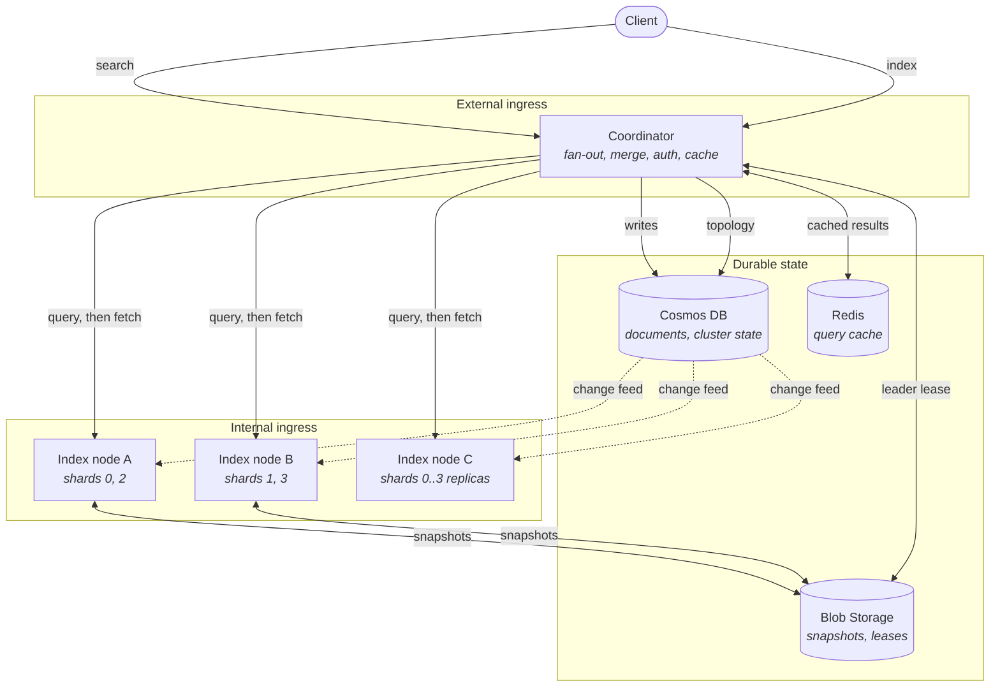
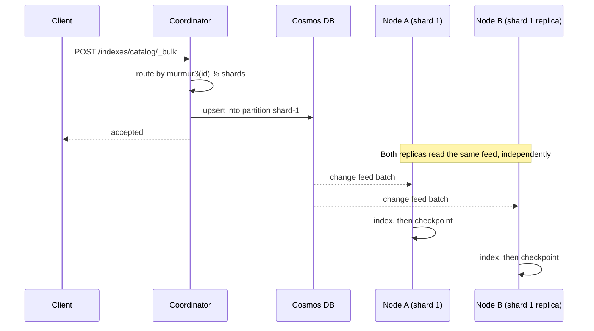
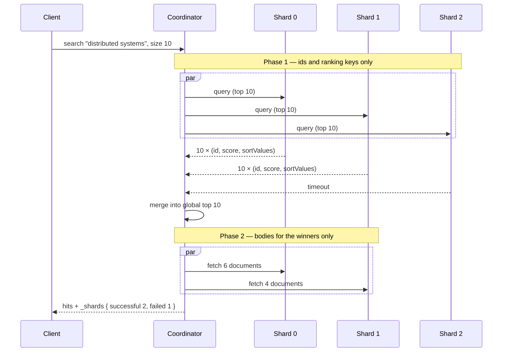
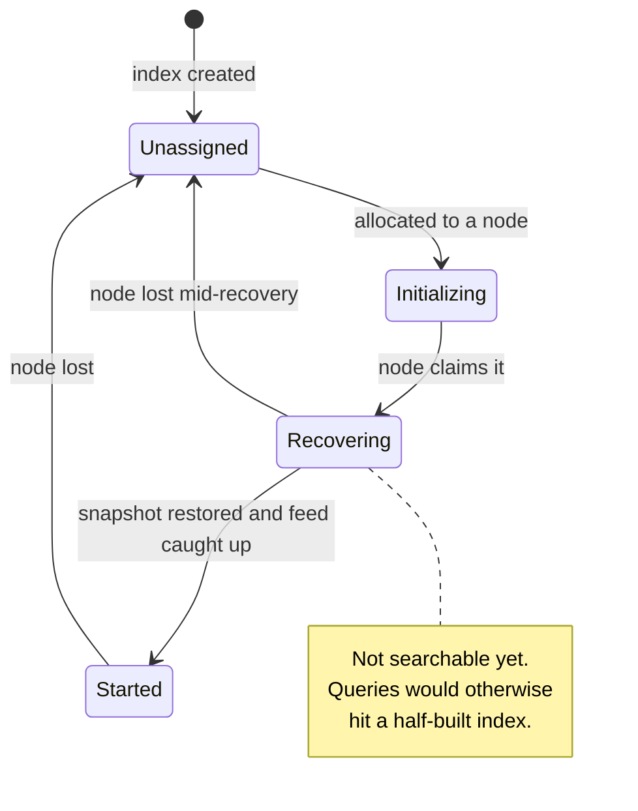
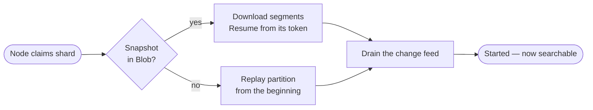

# Architecture

A distributed search engine: an inverted index, sharded across nodes, with Cosmos DB as the durable
source of truth and Azure Container Apps as the compute layer. The decisions behind each choice are
recorded in [`adr/`](adr/README.md); this document explains how the pieces fit together.

## The shape of the system

The dotted arrows carry the single most important idea in the design: **writes never travel from the
coordinator to the index nodes**. They go to Cosmos, and each node discovers them by reading the
change feed. Everything else follows from that.

## Writes: why there is no replication protocol

A conventional search cluster replicates by shipping a log from a primary to its replicas, which
means inventing ordering, retention, back-pressure and catch-up semantics. Here, Cosmos already
provides an ordered, durable, replayable log per partition key, so the search index becomes a
**disposable materialised view** and replicas are simply independent readers of the same feed.

Consequences worth stating plainly:

- **Replicas are symmetric.** There is no write-path primary. One copy is nominated as snapshot
  owner purely so that N replicas do not upload identical bytes to Blob Storage.
- **Indexing is asynchronous.** A document is durable the moment Cosmos accepts it, and searchable a
  moment later. This is the near-real-time trade-off, and `refresh_interval` is its dial.
- **The pull model is mandatory.** The Change Feed Processor distributes ranges across consumers;
  every replica needs its shard's *complete* feed, and only the pull model can read a single
  partition key.
- **Deletes are tombstones.** The latest-version feed does not carry deletions, so a hard delete
  would simply vanish and replicas would never learn the document was gone.
- **At-least-once is safe** because the checkpoint is written *after* a batch is applied and indexing
  is an upsert keyed by document id, making redelivery idempotent.

## Reads: query then fetch

Phase one deliberately carries no document bodies. A single-phase fan-out would have every shard
send its full top-k across the network, most of which loses the merge and is discarded. Phase two
contacts only the shards that actually own a winning document — in the diagram, shard 2 is never
asked for a body even had it responded.

Three properties fall out of this design, and each is surfaced honestly in the response rather than
hidden:

| Property | Why | Where it shows |
| --- | --- | --- |
| Scores are per-shard by default | Each shard computes IDF from its own document frequencies | `search_type=dfs_query_then_fetch` adds a pre-pass for exact global scoring |
| Terms facets are approximate | A shard reports only its own top buckets | `doc_count_error_upper_bound`, `sum_other_doc_count` |
| A failed shard does not fail the query | Most of a result set beats an error | `_shards.failed`, `timed_out`, `total_is_lower_bound` |

Within a shard, a query runs against immutable segments with WAND pruning: each clause reports an
upper bound on its contribution, and any document whose combined bound cannot beat the current
top-k threshold is skipped without being scored. Pruning changes work done, never results — a
randomised property test asserts pruned output is identical to exhaustive scoring.

## Cluster state and shard placement

Placement is a pure function, computed identically by any coordinator:

- **Document → shard**: `murmur3_32(routingKey ?? id) % numberOfShards`, with the shard count fixed
  at index creation. The result doubles as the Cosmos partition key.
- **Shard → node**: rendezvous (highest-random-weight) hashing over the live node set, which needs
  no ring state and moves only the shards belonging to a departed node.

Only the instance holding a **Blob lease** reconciles the allocation table, and every write to it is
a compare-and-swap on the state's ETag — so leadership is an optimisation for avoiding conflicting
work, not the thing correctness rests on.

## Recovery

Container Apps replicas have ephemeral disks, so a node starting with an empty index is the *normal*
case, not an exceptional one. Making recovery the everyday path means it is exercised constantly.

The snapshot manifest records the change-feed continuation token that the snapshot corresponds to,
which is what turns recovery into a download plus a short catch-up. The manifest is written *last*,
after every file it names, so an interrupted upload leaves the previous snapshot intact; and a
commit is refused if a newer generation already exists, so an out-of-order upload cannot roll a
replica backwards.

## Component map

| Project | Responsibility |
| --- | --- |
| `DistSear.Abstractions` | Contracts: mappings, requests, cluster topology, storage and transport interfaces |
| `DistSear.Analysis` | Tokenizer and filter chain, composed by a named analyzer registry |
| `DistSear.Index` | Postings, segments, BM25, query AST and parser, facets, highlighting, suggestions |
| `DistSear.Cluster` | Routing, allocation, replica selection, leader-elected reconciliation, in-memory stores |
| `DistSear.Storage.Azure` | Cosmos and Blob implementations of the storage interfaces |
| `DistSear.Node` | Shard runtime, change-feed indexer, snapshots, shard-local query endpoints |
| `DistSear.Coordinator` | Fan-out, merge, caching, authentication, rate limiting, public API |
| `DistSear.Client` | Typed client SDK |

Every Azure dependency sits behind an interface with both an Azure and an in-process
implementation. That is what allows an entire cluster — routing, recovery, fan-out, failover — to run
inside a unit test with no Docker, and it is the single most load-bearing decision for testability.

## Further reading

- [`DATA-MODEL.md`](DATA-MODEL.md) — Cosmos containers, the segment binary format, Blob layout
- [`API.md`](API.md) — the REST surface
- [`OPERATIONS.md`](OPERATIONS.md) — deploying, scaling, and what to do when something breaks
- [`LOCAL-DEV.md`](LOCAL-DEV.md) — running the stack locally
- [`adr/`](adr/README.md) — why each decision was made, and what was rejected
